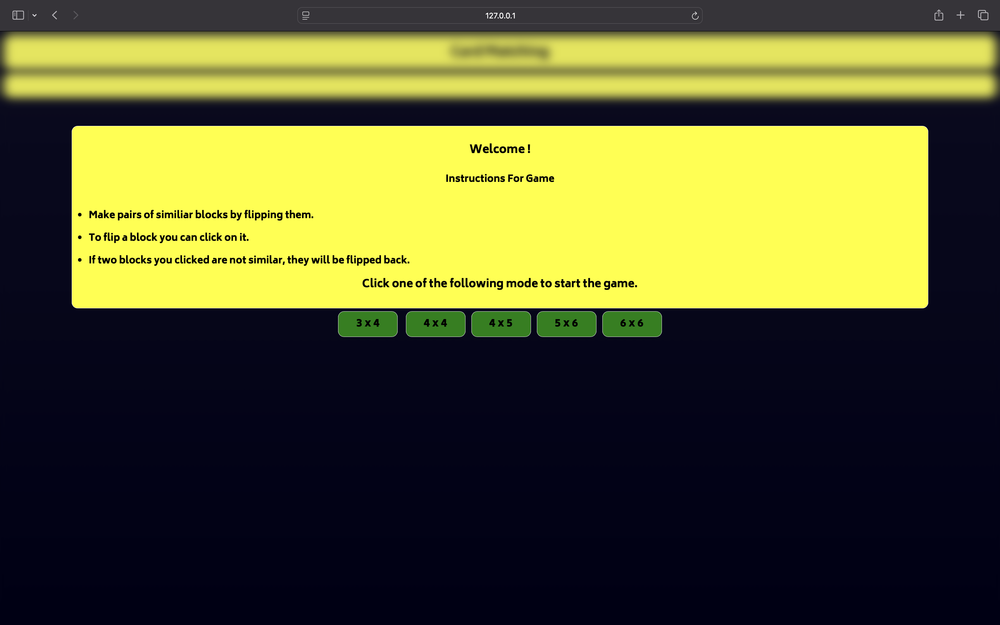
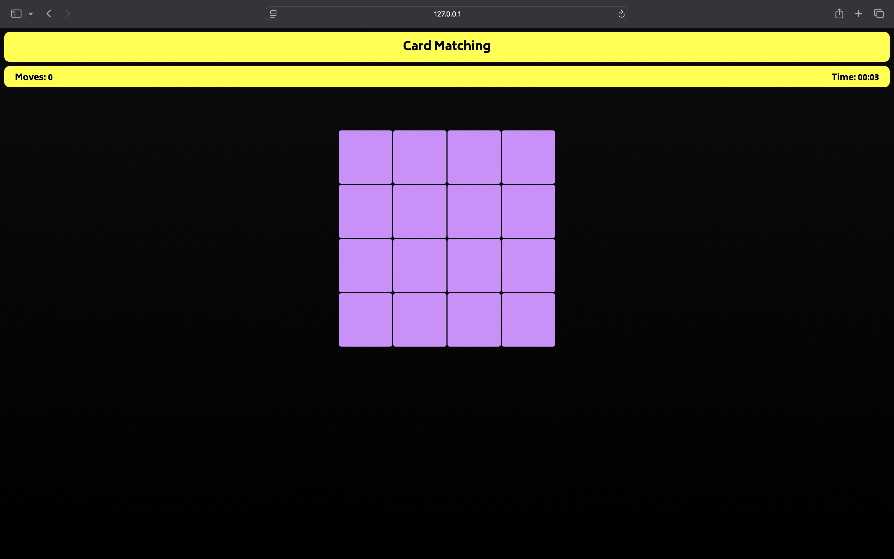
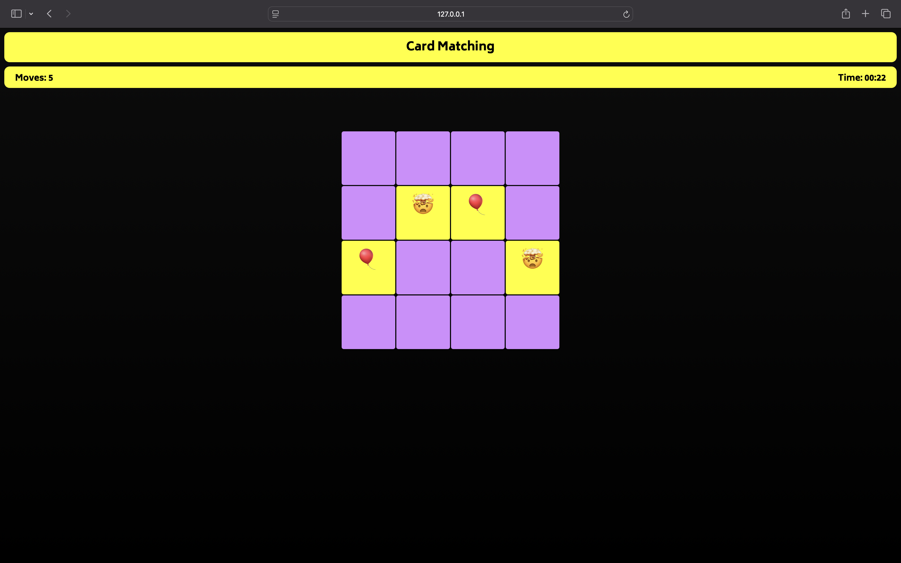
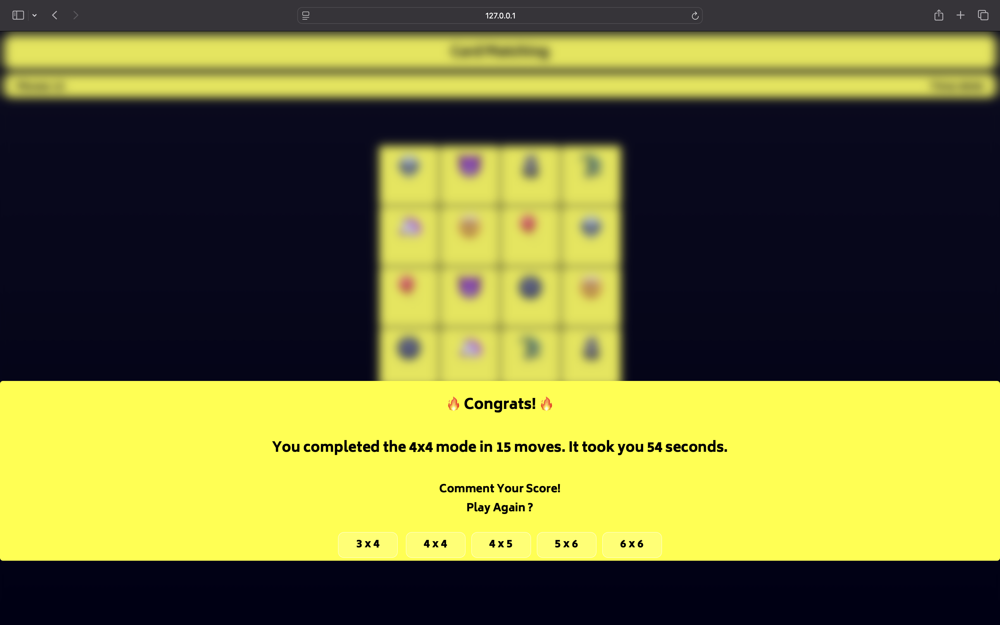

## Memory Game 🧠🎮

Welcome to the **Memory Game**! Test your memory skills by flipping cards to find matching emoji pairs. This is a fun, interactive game built with HTML, CSS, and JavaScript.

---

## 🎮 How to Play

1. **Objective**: Match all pairs of emojis by flipping the cards.
2. Click on any card to flip it.
3. If two flipped cards match, they remain open; otherwise, they flip back.
4. Complete the game as quickly as possible with the least number of moves.

---

## ✨ Features

- **Dynamic Gameplay**: Choose from multiple grid sizes:
  - `3 x 4`, `4 x 4`, `4 x 5`, `5 x 6`, or `6 x 6`.
- **Timer and Moves Tracker**: Keep track of your performance.
- **Color Highlights**: Matched pairs are highlighted.
- **Responsive Design**: Works seamlessly on devices of all sizes.
- **Interactive UI**: Instructions and congratulatory messages on game completion.

---

## 🖼️ Screenshots

### 1. Welcome Screen


### 2. Game Board


### 3. Matched Cards Highlight


### 4. Game Completion Screen


---

## 🚀 How to Run Locally

1. Clone this repository:
   ```bash
   git clone https://github.com/devangyadav/cardmatching.git
2. Open the project folder
   ```bash
   cd cardmatching
3. Launch the index.html file in your browser.

## 📜 License
This project is open-source and available under the MIT [MIT License](LICENSE).

